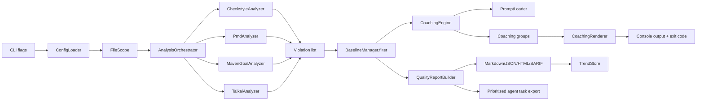

# Architecture

habit-hooks is a single-process Java CLI that transforms Java quality-tool
findings into concise, actionable coaching for AI coding agents.

## Runtime flow

## CLI precedence and defaults

Scope is resolved in `HabitHooksCommand` with this precedence:

1. `--all`
2. `--last <n>`
3. `--branch [name]`
4. `--since <hash>`
5. Config default (`scope.onlyChangedFiles` + `scope.branchBase`)

If `scope.excludeTests` is true (default), test files under `src/test` are removed
from the final file set regardless of scope mode.

Configuration loading behavior:

- Default config path is `.habit-hooks.yaml` in the working directory.
- `--config <path>` accepts absolute paths and working-directory-relative paths.
- Missing/malformed config falls back to safe defaults.
- Null/blank config values are normalized to defaults at read time.

## Package responsibilities

- `com.patbaumgartner.habithooks.cli`: command-line entrypoints and argument parsing.
- `com.patbaumgartner.habithooks.config`: YAML configuration model and loading.
- `com.patbaumgartner.habithooks.scope`: Java file selection based on git scope or full scan.
- `com.patbaumgartner.habithooks.analyzer`: tool wrappers that normalize findings.
- `com.patbaumgartner.habithooks.model`: immutable domain records for violations/results.
- `com.patbaumgartner.habithooks.baseline`: baseline persistence and suppression checks.
- `com.patbaumgartner.habithooks.coaching`: prompt lookup, grouping, and rendering.
- `com.patbaumgartner.habithooks.init`: scaffolding for first-time project setup.
- `com.patbaumgartner.habithooks.report`: local quality reports, SARIF, and trend snapshots.
- `com.patbaumgartner.habithooks.tasks`: rule-grouped task batches for AI agents.

## Artifact commands

- `report` builds a stable `QualityReport`, writes `report.md`, `report.json`,
    `report.html`, or `report.sarif`, and records the latest local trend snapshot.
- `tasks` turns findings into prioritized, rule-grouped work items with locations,
    acceptance criteria, and a verification command for AI agents.
- `doctor` checks analyzer availability before a full run spends time on a broken setup.
- `dependencies` wraps the Maven Versions Plugin for repeatable dependency and
    plugin update reports, with an explicit `--apply` mode for parent/property updates.

## Design constraints

- Java 25 baseline to use modern language features and a single CI runtime matrix.
- Sealed analyzer abstraction to keep orchestrator behavior exhaustive and explicit.
- Baseline suppression is commit-hash aware and invalidates on dirty files.
- Tooling-first design: Checkstyle and PMD remain source-of-truth for rule semantics.
- Project-scoped analyzers can run without a changed-file list so whole-build signals
    such as coverage, mutation testing, formatter validation, SBOM checks, compiler
    checks, and architecture tests still reach the agent.
- Safe-default config model: omitted/null/blank values resolve to behaviorally stable defaults.

## Build and quality gates

- Unit tests with JUnit 5 and AssertJ.
- Integration tests through Maven Failsafe (`*IT.java`) for end-to-end command flows.
- JaCoCo minimum line coverage gate at 70%.
- Checkstyle, PMD/CPD, SpotBugs, spring-javaformat formatting check, and optional PIT mutation profile.
- Optional habit-hooks analyzers can normalize SpotBugs, JaCoCo, CycloneDX, PIT,
    OWASP Dependency Check, Spring Java Format, Error Prone, and JSpecify feedback.
- Supply-chain controls include SBOM generation, CodeQL, OWASP dependency checks,
  OpenSSF Scorecard, keyless signatures, and SLSA provenance in release pipelines.
